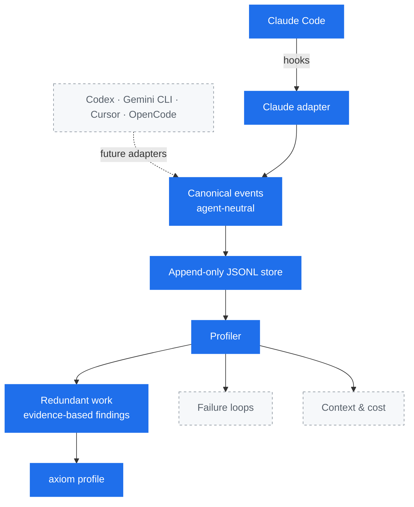
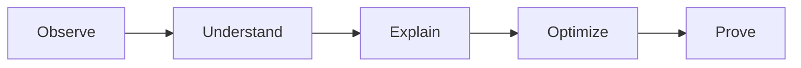

# Axiom

**A profiler for AI coding agents.**

Find wasted context, redundant work, failure loops, and unnecessary cost.

> Correctness first. Measure before optimizing.

## Why Axiom?

Most tooling can tell you *how much* an agent consumed: tokens, dollars,
minutes. That number tells you a bill was large. It does not tell you which
part of the session was avoidable.

Axiom aims to explain *why*. The same file read six times without changing, the
same search repeated across three turns, a command that failed and was retried
four ways: these are the things that turn a small task into an expensive one,
and they are only visible if something is recording what the agent actually
did.

Axiom makes no claims about token savings. It is being built to measure first
and recommend second.

## Status

Early. Axiom **records** agent activity and reports **redundant work** it can
prove from that record.

What works today:

- A passive Claude Code integration that observes session and tool events
- An agent-neutral event model
- A local append-only event log
- A profiler that reports repeated shell commands and repeated file reads

Not built yet: repeated-search detection, failure-loop detection, cost and token
accounting, recommendations, and support for agents other than Claude Code.

## How it works



Solid boxes exist today; dashed boxes are roadmap.

Everything below the canonical event boundary is written against Axiom's own
event model, not against Claude Code. That is what makes a second agent an
adapter rather than a second profiler.

## Philosophy



Each step depends on the one before it. Axiom observes and explains. It does not
optimize anything, and it never changes what your agent does.

## Requirements

- Go 1.26 or newer
- Claude Code, for the current integration

## Install

```bash
git clone https://github.com/exequieldeferrari/axiom.git
cd axiom
make build
```

## Usage

```bash
axiom                    # show help
axiom version            # print version
axiom init --dry-run     # preview the Claude Code hook installation
axiom init               # install hooks for this project
axiom init --global      # install hooks for all your projects
axiom profile            # analyze recorded events
```

`axiom hook claude` is the machine-facing entrypoint Claude Code calls. You do
not run it by hand.

### Installing the Claude Code integration

`axiom init` writes four hooks into your Claude Code settings: `SessionStart`,
`PostToolUse`, `PostToolUseFailure`, and `SessionEnd`.

By default it writes `.claude/settings.local.json` in the current directory.
That file is project-scoped and is not meant to be committed, so installing
Axiom does not enable it for teammates who do not have the binary. Use
`--global` to write `~/.claude/settings.json` instead and observe every project.

Installation is conservative:

- Existing hooks and unrelated settings are preserved
- Running it twice changes nothing
- The file is replaced atomically and its permissions are kept
- If the settings file cannot be parsed, Axiom refuses to touch it
- If an Axiom hook already points at a different binary, Axiom reports the
  conflict instead of rewriting it

Claude Code adds `.claude/settings.local.json` to your git excludes only when it
writes that file itself. If Axiom creates it, add it to your `.gitignore`.

## Profiling

`axiom profile` analyzes the recorded events and reports repeated work. It only
ever reads the log.

```console
$ axiom profile
Axiom Profile
─────────────

Events              29
Sessions analyzed   2
Tool calls          25

Redundant work

  No high-confidence redundant work detected.
```

A quiet report is a real result. Axiom would rather miss redundant work than
invent it, so it only reports repetition it can justify:

```console
  HIGH  Repeated shell operation                   session 7b4d3ab1
        Executed 3 times, with only read-only operations in between
        Potentially redundant executions  2
        Repeated-call tool time           640ms
        Command digest                    3f1c0a9e77b4…
        Window                            2026-08-10 20:25:04 → 20:29:11 UTC
```

### What Axiom will and will not call redundant

Repetition only counts inside a single session, and inside a single subagent
within it. A later session legitimately redoes work because the agent no longer
remembers it, so cross-session repetition is never reported. The same applies
when Claude Code compacts or clears context mid-session.

A repeated **shell command** is reported when the same command digest runs more
than once with nothing but read-only operations in between. Any file edit, any
other command, or anything Axiom cannot interpret ends the sequence, because all
of them are ordinary reasons to run something again.

A repeated **file read** is reported when the same file is read more than once
with no observed modification and no unobservable operation in between. Axiom
never claims the file was unchanged — only that it saw nothing change it. A
command such as `gofmt -w`, an MCP tool, or your own editor can modify a file
without Axiom knowing, which is precisely why anything opaque ends the sequence.

Retries do not count as redundancy: a command re-run after failing is a retry,
and failure-loop analysis is a separate concern Axiom does not tackle yet.

`Repeated-call tool time` is how long the repeated calls took to execute, not
counting the first. It is not the total time of the operation, and it measures
nothing about context, tokens, or cost. For file reads it is usually a few
milliseconds — the cost of a redundant read is the context it consumes, which
Axiom does not estimate.

## Where events go

Events are appended as JSON Lines to a local file:

| Platform | Location |
| --- | --- |
| macOS | `~/Library/Application Support/axiom/events.jsonl` |
| Linux | `$XDG_DATA_HOME/axiom/events.jsonl`, or `~/.local/share/axiom/events.jsonl` |
| Windows | `%AppData%\axiom\events.jsonl` |

Set `AXIOM_DATA_DIR` to override. The file is written `0600` and is meant to be
readable with `tail`, `jq`, or your editor.

```console
$ tail -1 ~/Library/Application\ Support/axiom/events.jsonl | jq .
{
  "schema_version": 1,
  "agent": "claude-code",
  "type": "tool_call",
  "timestamp": "2026-08-10T19:41:11.902Z",
  "session_id": "7f3a1c92-4b8e-4c11-9a72-2d6f0e5b1a30",
  "turn_id": "550e8400-e29b-41d4-a716-446655440000",
  "cwd": "/Users/you/project",
  "tool": {
    "name": "Read",
    "invocation_id": "toolu_01A7pQ9",
    "outcome": "success",
    "duration_ms": 12,
    "metadata": {
      "file": {
        "path": "/Users/you/project/internal/acm/manager.go",
        "access": "read"
      }
    }
  }
}
```

## Privacy

Axiom is local-first and metadata-first. Nothing is sent anywhere, and Axiom
makes no network calls at all.

**Never recorded:** file contents, the text of edits, tool output, agent error
text, prompts, shell command text, or search patterns.

**Recorded instead:** for a shell command or a search pattern, a SHA-256 digest.
A digest is enough to notice that the same command ran five times without
storing what the command was. Digests are domain-separated, so a shell command
and a search pattern with identical text never look equivalent.

**Recorded in clear text:** file paths and the working directory. This is a
deliberate trade-off. A finding is only actionable if it can say
`internal/acm/manager.go read 6 times` rather than naming a hash, and the data
never leaves your machine. Be aware that paths can carry project, client, or
customer names. A future strict mode will be able to redact them: every path in
the schema lives in one of three places (`cwd`, `tool.metadata.file.path`, and
`tool.metadata.search.root`).

Metadata extraction is an allowlist. Tools Axiom has not explicitly reviewed,
including every MCP tool, contribute no metadata at all.

## What Axiom cannot see

Being honest about the blind spots, because they affect how the data should be
read:

- **Blocked and denied tool calls are invisible.** Axiom observes only calls
  that ran. `PreToolUse` is deliberately not used, so tool call counts are a
  lower bound.
- **Sessions may have no end.** If the agent is killed, no `SessionEnd` arrives.
- **A session is not a unit of work.** Claude Code starts a new session on
  `/clear` and after compaction, so one sitting can span several session IDs.
- **Durations exclude waiting on you.** Claude Code reports tool execution time,
  not the time spent in permission prompts.
- **Recorded order only approximates execution order.** Hooks run as parallel
  processes, so two tool calls that overlapped may be recorded in either order.

## Non-interference

Axiom is a passive observer. It never blocks, delays a decision, or modifies a
tool call. Its hook always exits successfully and never writes to stdout, so a
bug in Axiom cannot change what your agent does or sees. If Axiom cannot record
an event, it drops the event and stays quiet.

## Development

```bash
make build   # build ./bin/axiom
make test    # go test ./...
make lint    # gofmt check + go vet
make run     # go run ./cmd/axiom
```

Release builds can override the version string:

```bash
go build -ldflags "-X github.com/exequieldeferrari/axiom/internal/version.Version=v1.2.3" -o bin/axiom ./cmd/axiom
```

Architecture decisions are recorded in [docs/adr](docs/adr).

## License

[Apache License 2.0](LICENSE)
