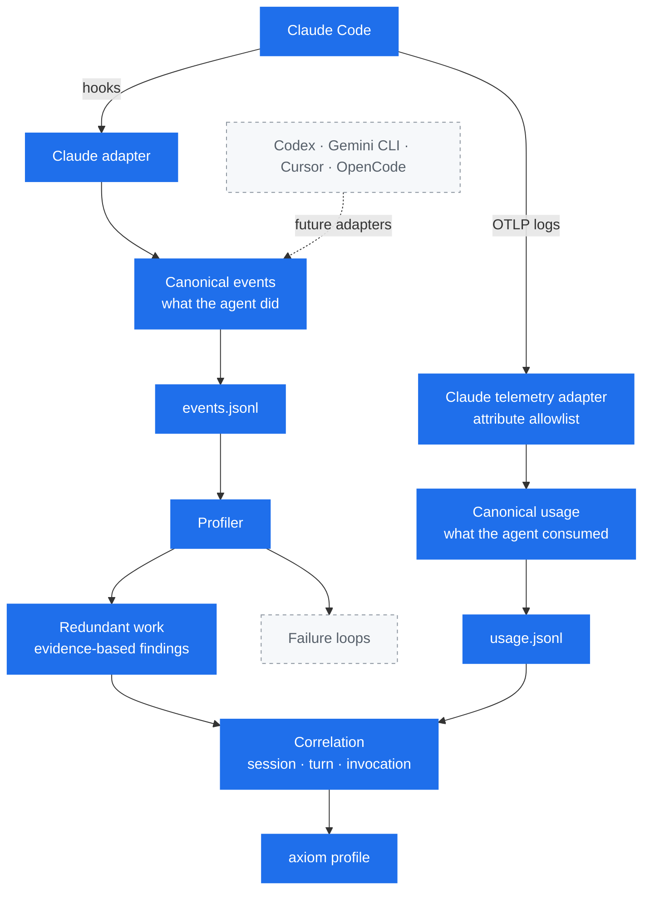
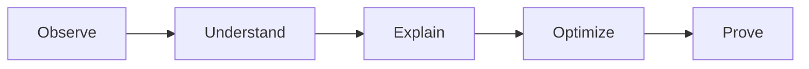

<p align="center">
  
</p>

<p align="center">
  <strong>A profiler for AI coding agents.</strong>
</p>

<p align="center">
  Find wasted context, redundant work, failure loops, and unnecessary cost.
</p>

<p align="center">
  <em>Correctness first. Measure before optimizing.</em>
</p>

## Why Axiom?

Most tooling can tell you *how much* an agent consumed: tokens, dollars,
minutes. That number tells you a bill was large. It does not tell you which
part of the session was avoidable.

Axiom aims to explain *why*. The same file read six times without changing, the
same search repeated across three turns, a command that failed and was retried
four ways: these are the things that turn a small task into an expensive one,
and they are only visible if something is recording what the agent actually
did.

Axiom makes no claims about token savings. It is being built to measure first
and recommend second.

## Status

Early. Axiom **records** agent activity and reports **redundant work** it can
prove from that record.

What works today:

- A passive Claude Code integration that observes session and tool events
- An OTLP receiver that records what Claude Code reports consuming
- An agent-neutral event model
- Local append-only logs, one per stream
- A profiler that reports repeated shell commands and repeated file reads
- Measured tool output for redundant calls, when a receiver recorded it
- The consumption observed in the turns a finding happened in

Not built yet: repeated-search detection, failure-loop detection,
recommendations, and support for agents other than Claude Code. Axiom reports
consumption it observed but does not attribute it, and makes no savings claims.

## How it works

Axiom observes two independent streams. One says what the agent did, the other
says what it consumed.



Solid boxes exist today; dashed boxes and dashed arrows are roadmap.

The two streams are deliberately independent. They have different writers and
different lifetimes: hooks fire on every tool call, while usage records exist
only while `axiom observe` is running. Keeping them apart is what lets Axiom
tell "this session consumed nothing" from "nobody was listening".

They are joined only at the end, and only on identifiers both streams carry:
the session, the turn, and the tool invocation. Behavior always comes from the
event stream, so a measurement can add a number to a finding but can never
create one.

The join answers two different questions and keeps them apart. A tool result
belongs to one invocation, so it is attributed to it. A model request belongs to
a turn, which other calls and requests may share, so it is reported as what was
going on around a finding and never as its cost.

Everything below the canonical boundary is written against Axiom's own model,
not against Claude Code. That is what makes a second agent an adapter rather
than a second profiler.

## Philosophy



Each step depends on the one before it. Axiom observes and explains. It does not
optimize anything, and it never changes what your agent does.

## Requirements

- Go 1.26 or newer
- Claude Code, for the current integration

## Install

```bash
git clone https://github.com/exequieldeferrari/axiom.git
cd axiom
make build
```

## Usage

```bash
axiom                    # show help
axiom version            # print version
axiom init --dry-run     # preview the Claude Code hook installation
axiom init               # install hooks for this project
axiom init --global      # install hooks for all your projects
axiom init --telemetry   # also export Claude Code's telemetry to axiom
axiom observe            # record that telemetry while you work
axiom profile            # analyze recorded events
```

`axiom hook claude` is the machine-facing entrypoint Claude Code calls. You do
not run it by hand.

### Installing the Claude Code integration

`axiom init` writes four hooks into your Claude Code settings: `SessionStart`,
`PostToolUse`, `PostToolUseFailure`, and `SessionEnd`.

By default it writes `.claude/settings.local.json` in the current directory.
That file is project-scoped and is not meant to be committed, so installing
Axiom does not enable it for teammates who do not have the binary. Use
`--global` to write `~/.claude/settings.json` instead and observe every project.

Installation is conservative:

- Existing hooks and unrelated settings are preserved
- Running it twice changes nothing
- The file is replaced atomically and its permissions are kept
- If the settings file cannot be parsed, Axiom refuses to touch it
- If an Axiom hook already points at a different binary, Axiom reports the
  conflict instead of rewriting it

Claude Code adds `.claude/settings.local.json` to your git excludes only when it
writes that file itself. If Axiom creates it, add it to your `.gitignore`.

## Recording usage

Hooks say what the agent did. They say nothing about what it cost. Claude Code
reports that separately, over OpenTelemetry, and `axiom observe` receives it.

```bash
axiom init --telemetry   # configure Claude Code to export, once
axiom observe            # receive and record, while you work
```

`axiom observe` runs in the foreground and prints each measurement as it
arrives:

```console
$ axiom observe
Axiom is listening on http://127.0.0.1:4318/v1/logs
Recording to ~/Library/Application Support/axiom/usage.jsonl

Run 'axiom init --telemetry' if Claude Code is not configured to export yet.
Press Ctrl-C to stop.

  21:33:02  model_request  claude-sonnet-5  2 in · 121 out · 15689 cache read · 20051 cache write
  21:33:03  tool_result    Bash             5 B returned
  21:33:05  model_request  claude-sonnet-5  2 in · 3 out · 35740 cache read · 128 cache write
^C
Recorded 3 usage records in 43s.
```

Each line describes only what that telemetry record itself reported. The
receiver never opens the event log: the two streams are joined by
[`axiom profile`](#measured-redundant-output), deliberately and on identifiers
alone, not by a live view guessing at what a record probably belongs to.

**Usage is only recorded while `axiom observe` is running.** Nothing is queued
or backfilled. If you were not listening, that telemetry is gone, which is why a
session with no usage records means *unknown*, never *free*.

### What `axiom init --telemetry` configures

Four environment variables in your Claude Code settings, and nothing else:

```
CLAUDE_CODE_ENABLE_TELEMETRY=1
OTEL_LOGS_EXPORTER=otlp
OTEL_EXPORTER_OTLP_LOGS_PROTOCOL=http/json
OTEL_EXPORTER_OTLP_LOGS_ENDPOINT=http://127.0.0.1:4318/v1/logs
```

Only the logs signal, and only through its per-signal variables. The generic
`OTEL_EXPORTER_OTLP_*` variables apply to every signal, so Axiom never writes
them: setting them would redirect metrics and traces it does not receive.

If you already export telemetry somewhere, Axiom will not take it over. Any
existing generic OTLP variable, or a logs variable set to something else, is
reported as a conflict and **nothing is written at all** — not even the hooks.
Use `--addr` on both commands if port 4318 is already in use.

Claude Code's exporter is fire-and-forget. When Axiom is not listening, the
telemetry is dropped and your session is unaffected.

## Profiling

`axiom profile` analyzes the recorded events and reports repeated work. It only
ever reads the log.

```console
$ axiom profile
Axiom Profile
─────────────

Events              29
Sessions analyzed   2
Tool calls          25

Redundant work

  No high-confidence redundant work detected.
```

A quiet report is a real result. Axiom would rather miss redundant work than
invent it, so it only reports repetition it can justify:

```console
  HIGH  Repeated shell operation                   session 7b4d3ab1
        Executed 3 times, with only read-only operations in between
        Potentially redundant executions  2
        Repeated-call tool time           640ms
        Command digest                    3f1c0a9e77b4…
        Window                            2026-08-10 20:25:04 → 20:29:11 UTC
```

### What Axiom will and will not call redundant

Repetition only counts inside a single session, and inside a single subagent
within it. A later session legitimately redoes work because the agent no longer
remembers it, so cross-session repetition is never reported. The same applies
when Claude Code compacts or clears context mid-session.

A repeated **shell command** is reported when the same command digest runs more
than once with nothing but read-only operations in between. Any file edit, any
other command, or anything Axiom cannot interpret ends the sequence, because all
of them are ordinary reasons to run something again.

A repeated **file read** is reported when the same file is read more than once
with no observed modification and no unobservable operation in between. Axiom
never claims the file was unchanged — only that it saw nothing change it. A
command such as `gofmt -w`, an MCP tool, or your own editor can modify a file
without Axiom knowing, which is precisely why anything opaque ends the sequence.

Retries do not count as redundancy: a command re-run after failing is a retry,
and failure-loop analysis is a separate concern Axiom does not tackle yet.

`Repeated-call tool time` is how long the repeated calls took to execute, not
counting the first. It is not the total time of the operation, and it measures
nothing about context, tokens, or cost. For file reads it is usually a few
milliseconds — the cost of a redundant read is the context it consumes, which
Axiom does not estimate.

### Measured redundant output

If a receiver was running (see [Recording usage](#recording-usage)), findings
also report what the repeated calls actually returned:

```console
  HIGH  Repeated file read                         session 7b4d3ab1
        Read 3 times, with no agent modification observed in between
        Potentially redundant reads       2
        Redundant tool output             15.0 KB
        Repeated-call tool time           4ms
        File                              /repo/internal/store/store.go
        Window                            2026-08-10 20:25:04 → 20:25:09 UTC
```

The size is measured, never estimated. Axiom joins the two streams on the
session, turn, and invocation identifiers both of them carry, sums only the
repeated occurrences, and excludes the first call, which did the work. It is a
count of bytes the agent reported returning — not tokens, and not cost.

The line appears only when every repeated call was measured exactly once. When
it is missing the total is unknown, which is the usual case: telemetry exists
only for the time a receiver was running, and a measurement that is absent,
duplicated, or sizeless is never treated as zero.

### What the turn consumed

A finding on its own does not say whether it happened somewhere expensive. When
a receiver recorded the model requests behind a finding's turns, Axiom shows
what they consumed:

```console
  HIGH  Repeated file read                         session 7b4d3ab1
        Read 3 times, with no agent modification observed in between
        Potentially redundant reads       2
        Redundant tool output             15.0 KB
        Repeated-call tool time           4ms
        File                              /repo/internal/store/store.go
        Window                            2026-08-10 20:25:04 → 20:25:09 UTC

        Observed model consumption in the turn where this happened
          Model requests                  2
          Input tokens                    8
          Output tokens                   401
          Cache read                      117,147
          Cache creation                  41,141
          Model cost                      $0.2880
          This is the observed model consumption
          for that turn, not the cost of the repetition.
```

Read the two blocks differently. Everything above the heading is attributable
to the repetition. Everything below it was observed in the turns where the
repetition happened — a turn is the execution context the agent identifies, and
other tool calls and model requests share it, so those totals cover them too.
**Axiom does not know how much of it the repetition caused, and neither does
anything in the recording.**

That is also why nothing here is ever called wasted, saved, or avoidable, and
why these figures cannot be added up across findings: two findings in the same
turn each report all of that turn, not a share of it.

The counts stay in the four dimensions the agent reports, with no synthetic
total, and they are shown only when every observed request reported them. Cost
is the agent's own estimate for those requests.

Where a finding happened comes from the event stream; how much of it Axiom saw
depends on the receiver. When the two differ, the report says so rather than
describing a smaller finding:

```console
        Observed model consumption in 1 of the 3 turns where this happened
          Model requests                  1
          Input tokens                    2
          Output tokens                   93
          Cache read                      0
          Cache creation                  35,419
          Model cost                      $0.2139
          This is the observed model consumption
          for the turn it was recorded in, not the cost of the repetition.
```

The read still happened in three turns. Nothing is assumed about the two with
no records, and nothing is shown as zero for them.

## Where the data goes

Both streams are appended as JSON Lines to local files in one directory:

| Platform | Location |
| --- | --- |
| macOS | `~/Library/Application Support/axiom/` |
| Linux | `$XDG_DATA_HOME/axiom/`, or `~/.local/share/axiom/` |
| Windows | `%AppData%\axiom\` |

`events.jsonl` holds what the agent did, written by hooks. `usage.jsonl` holds
what it consumed, written by `axiom observe`. Set `AXIOM_DATA_DIR` to override
the directory. Files are written `0600` and are meant to be readable with
`tail`, `jq`, or your editor.

```console
$ tail -1 ~/Library/Application\ Support/axiom/events.jsonl | jq .
{
  "schema_version": 1,
  "agent": "claude-code",
  "type": "tool_call",
  "timestamp": "2026-08-10T19:41:11.902Z",
  "session_id": "7f3a1c92-4b8e-4c11-9a72-2d6f0e5b1a30",
  "turn_id": "550e8400-e29b-41d4-a716-446655440000",
  "cwd": "/Users/you/project",
  "tool": {
    "name": "Read",
    "invocation_id": "toolu_01A7pQ9",
    "outcome": "success",
    "duration_ms": 12,
    "metadata": {
      "file": {
        "path": "/Users/you/project/internal/acm/manager.go",
        "access": "read"
      }
    }
  }
}
```

A usage record is deliberately smaller. It says what was consumed, and carries
the identifiers that will one day let it be joined to the behavior above:

```console
$ tail -1 ~/Library/Application\ Support/axiom/usage.jsonl | jq .
{
  "schema_version": 1,
  "agent": "claude-code",
  "kind": "tool_result",
  "timestamp": "2026-08-11T00:33:03.076Z",
  "session_id": "b22394a4-9f31-4a0e-8c7d-1e5a3b6f24d8",
  "turn_id": "1eab842d-0c55-4f3a-9b21-77d4e0a6c913",
  "invocation_id": "toolu_01Tn7xQ2",
  "tool_name": "Bash",
  "duration_ms": 78,
  "result_bytes": 5
}
```

A measurement the agent did not report is absent rather than zero.

## Privacy

Axiom is local-first and metadata-first. Nothing is sent anywhere, and Axiom
makes no network calls at all.

**Never recorded:** file contents, the text of edits, tool output, agent error
text, prompts, shell command text, or search patterns.

**Recorded instead:** for a shell command or a search pattern, a SHA-256 digest.
A digest is enough to notice that the same command ran five times without
storing what the command was. Digests are domain-separated, so a shell command
and a search pattern with identical text never look equivalent.

**Recorded in clear text:** file paths and the working directory. This is a
deliberate trade-off. A finding is only actionable if it can say
`internal/acm/manager.go read 6 times` rather than naming a hash, and the data
never leaves your machine. Be aware that paths can carry project, client, or
customer names. A future strict mode will be able to redact them: every path in
the schema lives in one of three places (`cwd`, `tool.metadata.file.path`, and
`tool.metadata.search.root`).

Metadata extraction is an allowlist. Tools Axiom has not explicitly reviewed,
including every MCP tool, contribute no metadata at all.

### Telemetry privacy

Claude Code attaches your email address, user and account identifiers, your
organization identifier, and terminal details to **every** telemetry record it
sends. Axiom reads thirteen named attributes and ignores everything else, so
none of that reaches `usage.jsonl`. Service and machine attributes are dropped
before records are even inspected.

Claude Code can also be told to export prompts, assistant responses, tool
arguments, tool output, and raw API bodies. Axiom never writes any of those
settings, and would not store their contents if you enabled them yourself:

```
OTEL_LOG_USER_PROMPTS  OTEL_LOG_ASSISTANT_RESPONSES  OTEL_LOG_TOOL_DETAILS
OTEL_LOG_TOOL_CONTENT  OTEL_LOG_RAW_API_BODIES
```

The receiver binds to loopback only, and Axiom still makes no outbound network
calls of any kind.

## What Axiom cannot see

Being honest about the blind spots, because they affect how the data should be
read:

- **Blocked and denied tool calls are invisible.** Axiom observes only calls
  that ran. `PreToolUse` is deliberately not used, so tool call counts are a
  lower bound.
- **Sessions may have no end.** If the agent is killed, no `SessionEnd` arrives.
- **A session is not a unit of work.** Claude Code starts a new session on
  `/clear` and after compaction, so one sitting can span several session IDs.
- **Durations exclude waiting on you.** Claude Code reports tool execution time,
  not the time spent in permission prompts.
- **Recorded order only approximates execution order.** Hooks run as parallel
  processes, so two tool calls that overlapped may be recorded in either order.
- **Usage is only recorded while `axiom observe` runs.** The usage log is
  necessarily partial, and no usage record means unknown, not zero.
- **Behavior and usage are not yet connected.** Axiom records both streams and
  keeps the identifiers needed to join them, but does not join them today.

## Non-interference

Axiom is a passive observer. It never blocks, delays a decision, or modifies a
tool call. Its hook always exits successfully and never writes to stdout, so a
bug in Axiom cannot change what your agent does or sees. If Axiom cannot record
an event, it drops the event and stays quiet.

The same applies to telemetry. Claude Code exports it in the background and
discards what it cannot deliver, so a receiver that is stopped, crashed, or was
never started costs you nothing but the record.

## Development

```bash
make build   # build ./bin/axiom
make test    # go test ./...
make lint    # gofmt check + go vet
make run     # go run ./cmd/axiom
```

Release builds can override the version string:

```bash
go build -ldflags "-X github.com/exequieldeferrari/axiom/internal/version.Version=v1.2.3" -o bin/axiom ./cmd/axiom
```

Architecture decisions are recorded in [docs/adr](docs/adr).

## License

[Apache License 2.0](LICENSE)
