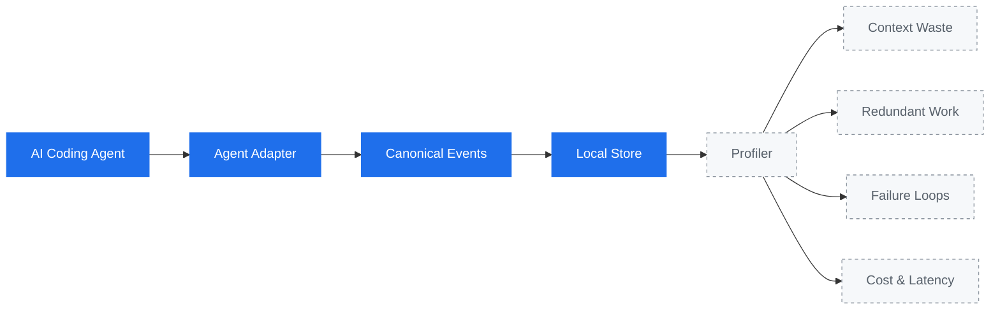
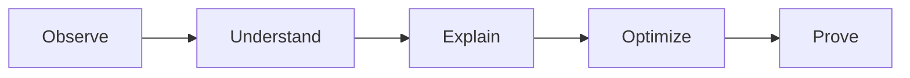

# Axiom

**A profiler for AI coding agents.**

Find wasted context, redundant work, failure loops, and unnecessary cost.

> Correctness first. Measure before optimizing.

## Why Axiom?

Most tooling can tell you *how much* an agent consumed: tokens, dollars,
minutes. That number tells you a bill was large. It does not tell you which
part of the session was avoidable.

Axiom aims to explain *why*. The same file read six times without changing, the
same search repeated across three turns, a command that failed and was retried
four ways: these are the things that turn a small task into an expensive one,
and they are only visible if something is recording what the agent actually
did.

Axiom makes no claims about token savings. It is being built to measure first
and recommend second.

## Status

Early. Axiom currently **records** agent activity. It does not analyze it yet.

What works today:

- A passive Claude Code integration that observes session and tool events
- An agent-neutral event model
- A local append-only event log

Not built yet: the profiler, findings, recommendations, cost and token
accounting, and support for agents other than Claude Code.

## How it works



Solid boxes exist today. Dashed boxes are roadmap: **Axiom records events and
does not yet analyze them.**

Claude Code is the first supported agent. The event model deliberately contains
no Claude-specific concepts, so other agents become adapters rather than
rewrites.

## Philosophy



Each step depends on the one before it. Axiom is at *Observe*.

## Requirements

- Go 1.26 or newer
- Claude Code, for the current integration

## Install

```bash
git clone https://github.com/exequieldeferrari/axiom.git
cd axiom
make build
```

## Usage

```bash
axiom                    # show help
axiom version            # print version
axiom init --dry-run     # preview the Claude Code hook installation
axiom init               # install hooks for this project
axiom init --global      # install hooks for all your projects
```

`axiom hook claude` is the machine-facing entrypoint Claude Code calls. You do
not run it by hand.

### Installing the Claude Code integration

`axiom init` writes four hooks into your Claude Code settings: `SessionStart`,
`PostToolUse`, `PostToolUseFailure`, and `SessionEnd`.

By default it writes `.claude/settings.local.json` in the current directory.
That file is project-scoped and is not meant to be committed, so installing
Axiom does not enable it for teammates who do not have the binary. Use
`--global` to write `~/.claude/settings.json` instead and observe every project.

Installation is conservative:

- Existing hooks and unrelated settings are preserved
- Running it twice changes nothing
- The file is replaced atomically and its permissions are kept
- If the settings file cannot be parsed, Axiom refuses to touch it
- If an Axiom hook already points at a different binary, Axiom reports the
  conflict instead of rewriting it

Claude Code adds `.claude/settings.local.json` to your git excludes only when it
writes that file itself. If Axiom creates it, add it to your `.gitignore`.

## Where events go

Events are appended as JSON Lines to a local file:

| Platform | Location |
| --- | --- |
| macOS | `~/Library/Application Support/axiom/events.jsonl` |
| Linux | `$XDG_DATA_HOME/axiom/events.jsonl`, or `~/.local/share/axiom/events.jsonl` |
| Windows | `%AppData%\axiom\events.jsonl` |

Set `AXIOM_DATA_DIR` to override. The file is written `0600` and is meant to be
readable with `tail`, `jq`, or your editor.

```console
$ tail -1 ~/Library/Application\ Support/axiom/events.jsonl | jq .
{
  "schema_version": 1,
  "agent": "claude-code",
  "type": "tool_call",
  "timestamp": "2026-08-10T19:41:11.902Z",
  "session_id": "7f3a1c92-4b8e-4c11-9a72-2d6f0e5b1a30",
  "turn_id": "550e8400-e29b-41d4-a716-446655440000",
  "cwd": "/Users/you/project",
  "tool": {
    "name": "Read",
    "invocation_id": "toolu_01A7pQ9",
    "outcome": "success",
    "duration_ms": 12,
    "metadata": {
      "file": {
        "path": "/Users/you/project/internal/acm/manager.go",
        "access": "read"
      }
    }
  }
}
```

## Privacy

Axiom is local-first and metadata-first. Nothing is sent anywhere, and Axiom
makes no network calls at all.

**Never recorded:** file contents, the text of edits, tool output, agent error
text, prompts, shell command text, or search patterns.

**Recorded instead:** for a shell command or a search pattern, a SHA-256 digest.
A digest is enough to notice that the same command ran five times without
storing what the command was. Digests are domain-separated, so a shell command
and a search pattern with identical text never look equivalent.

**Recorded in clear text:** file paths and the working directory. This is a
deliberate trade-off. A finding is only actionable if it can say
`internal/acm/manager.go read 6 times` rather than naming a hash, and the data
never leaves your machine. Be aware that paths can carry project, client, or
customer names. A future strict mode will be able to redact them: every path in
the schema lives in one of three places (`cwd`, `tool.metadata.file.path`, and
`tool.metadata.search.root`).

Metadata extraction is an allowlist. Tools Axiom has not explicitly reviewed,
including every MCP tool, contribute no metadata at all.

## What Axiom cannot see

Being honest about the blind spots, because they affect how the data should be
read:

- **Blocked and denied tool calls are invisible.** Axiom observes only calls
  that ran. `PreToolUse` is deliberately not used, so tool call counts are a
  lower bound.
- **Sessions may have no end.** If the agent is killed, no `SessionEnd` arrives.
- **A session is not a unit of work.** Claude Code starts a new session on
  `/clear` and after compaction, so one sitting can span several session IDs.
- **Durations exclude waiting on you.** Claude Code reports tool execution time,
  not the time spent in permission prompts.

## Non-interference

Axiom is a passive observer. It never blocks, delays a decision, or modifies a
tool call. Its hook always exits successfully and never writes to stdout, so a
bug in Axiom cannot change what your agent does or sees. If Axiom cannot record
an event, it drops the event and stays quiet.

## Development

```bash
make build   # build ./bin/axiom
make test    # go test ./...
make lint    # gofmt check + go vet
make run     # go run ./cmd/axiom
```

Release builds can override the version string:

```bash
go build -ldflags "-X github.com/exequieldeferrari/axiom/internal/version.Version=v1.2.3" -o bin/axiom ./cmd/axiom
```

Architecture decisions are recorded in [docs/adr](docs/adr).

## License

[Apache License 2.0](LICENSE)
