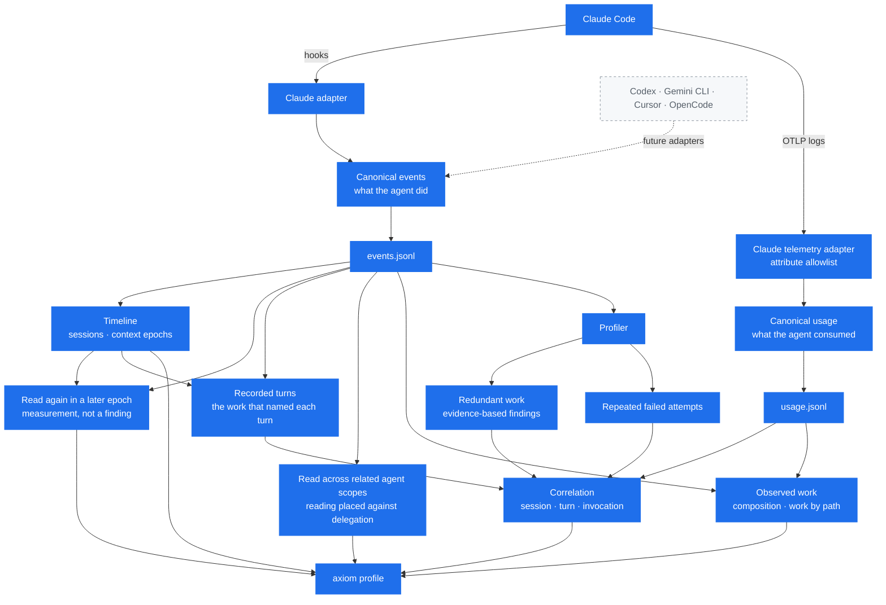
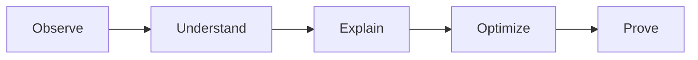

<p align="center">
  
</p>

<p align="center">
  <strong>A profiler for AI coding agents.</strong>
</p>

<p align="center">
  Reconstruct what a coding agent actually did — its turns, its context resets,
  the work it delegated — and report only what the record establishes.
</p>

<p align="center">
  <em>Correctness first. Measure before optimizing.</em>
</p>

## Why Axiom?

Most tooling can tell you *how much* an agent consumed: tokens, dollars,
minutes. That number tells you a bill was large. It does not tell you what the
agent was doing while it ran one up.

Axiom reconstructs the execution instead. From hook events and the agent's own
telemetry it derives structure nothing in the raw stream states — the context
epochs a session was cut into, the turns that recorded work, the nested agents
a turn launched and the calls those agents went on to make — and it records the
agent configuration that was in place when the session started. That
reconstruction is the reason to run it: a transcript holds the calls, and the
structure around them is what you would otherwise rebuild by hand.

Against that structure it reports the narrower observations the record
supports: the same file read on both sides of a context reset, one file read
in two agent scopes a launch relates, a command that failed three times, the
calls recorded before it later succeeded. Each of those needs its exact pattern
to have been recorded, so a session that produces none of them is a normal
outcome rather than an empty report.

Every line is bounded by the record. Where the log does not establish something,
Axiom says so rather than estimating it, and it never calls observed work
wasted, avoidable, or saved. Nothing is sent anywhere.

## Status

Early. Axiom **records** agent activity, **derives** the structure of the
execution from it — context epochs, turns, and delegated agent scopes — and
reports the observations and findings it can establish from the record.

What works today:

- A passive Claude Code integration that observes session and tool events
- An OTLP receiver that records what Claude Code reports consuming
- An agent-neutral event model
- Local append-only logs, one per stream
- A profile of the observed work: what the execution consisted of, and the paths
  it happened at
- The session identities in the log, and the context epochs recorded within them
- The paths read again in a later context epoch of one session identity
- The recorded turns of a session: the work each one did, and the consumption
  observed in it
- The subagent launches a turn made, and the recorded calls each launched agent
  went on to make
- The paths read in more than one agent scope that a recorded launch relates
- Measured read bytes per path, when a receiver recorded them
- A profiler that reports repeated shell commands and repeated file reads
- Repeated failed attempts at the same shell command, and what each attempt's
  failure report carried
- The tool calls recorded between a failed attempt and a later observed success
- Measured tool output for redundant calls, when a receiver recorded it
- The consumption observed in the turns a finding happened in
- A comparison of how the recorded structure of two captures differs, where an
  operator declares the two comparable

Not built yet: repeated-search detection, recommendations, and support for
agents other than Claude Code. A comparison covers structure only: consumption,
findings, paths and commands are not compared, and nothing about a difference is
called an improvement or a regression.
Axiom reports consumption it observed but does not attribute it, and makes no
savings claims. Nothing observed across a context epoch boundary or across two
agent scopes is measured in bytes, tokens or cost: a size printed beside it
would read as the price of the boundary, which nothing recorded establishes.

### v0.3.0

The third 0.x release. v0.1.0 made the workflow installable; v0.2.0 added the
context epochs a session was cut into; v0.3.0 is where the report describes the
*structure* of an execution rather than a flat log — the turns that recorded
work, the subagent launches inside them, the calls each launched agent made, and
the paths read across scopes that a launch relates.

It does not mean a stable CLI, a schema that will not change, completeness, or
readiness for anything beyond one developer's own machine. The `0.` is where the
instability is stated: expect the interface to move before 1.0.

Worth knowing before you try it:

- `axiom profile` reads the whole recorded log. There is no session or time
  filter beyond `--session`, so a log that has been accumulating reports all of
  it.
- The CLI and the JSONL schema may change before 1.0.
- Delegation is only as visible as the agent makes it. A launch relates scopes
  only where the agent returned an identity for the nested agent it created;
  events recorded by an earlier Axiom carry none, and those launches relate
  nothing rather than being guessed at.
- Measured bytes and model consumption exist only for the time a receiver was
  running; everywhere else they are absent, which is not zero.
- Claude Code is the only agent with an adapter.
- Two of the four published archives are run end to end before a release goes
  out: `linux/amd64` and `darwin/arm64`, on the CI runners that exist for them.
  The `darwin/amd64` and `linux/arm64` archives are cross-compiled and their
  checksums are verified, but they are never executed, so those two are published
  on the strength of the build rather than a run.

## How it works

Axiom observes two independent streams. One says what the agent did, the other
says what it consumed.



Solid boxes exist today; dashed boxes and dashed arrows are roadmap.

The two streams are deliberately independent. They have different writers and
different lifetimes: hooks fire on every tool call, while usage records exist
only while `axiom observe` is running. Keeping them apart is what lets Axiom
tell "this session consumed nothing" from "nobody was listening".

They are joined only at the end, and only on identifiers both streams carry:
the session, the turn, and the tool invocation. Behavior always comes from the
event stream, so a measurement can add a number to a finding but can never
create one.

The join answers two different questions and keeps them apart. A tool result
belongs to one invocation, so it is attributed to it. A model request belongs to
a turn, which other calls and requests may share, so it is reported as what was
observed in that turn and never as the cost of anything inside it.

Everything below the canonical boundary is written against Axiom's own model,
not against Claude Code. That is what makes a second agent an adapter rather
than a second profiler.

## Philosophy



Each step depends on the one before it. Axiom observes and explains. It does not
optimize anything, and it never changes what your agent does.

## Requirements

- macOS or Linux, on amd64 or arm64
- Claude Code 2.1.196 or newer
- Go 1.26 or newer, to build from source

Axiom groups work into turns using the `prompt_id` Claude Code sends with each
hook event. Versions before 2.1.196 do not send it, and the findings that depend
on a turn are unreliable without it. Every capture behind v0.3.0 was made
against Claude Code 2.1.228; later versions are expected to work but are not
covered by that check.

The delegation sections depend on more than `prompt_id`: a launch relates
scopes only where Claude Code returned an identity for the nested agent it
created, and reported that same identity on the calls that agent made. Where it
did not, the sections say so rather than relating scopes on timing.

Windows is untested and no Windows archive is published. The code compiles for
it, but nothing about its paths or its settings locations has been exercised
there. Under WSL2, use the Linux build.

## Install

### A released binary

Download the archive for your platform from the
[latest release](https://github.com/exequieldeferrari/axiom/releases/latest):

```bash
tar -xzf axiom_0.3.0_darwin_arm64.tar.gz
sudo mv axiom /usr/local/bin/
axiom version
```

Each archive holds the binary, the license, and this README. Every release
publishes `checksums.txt` beside them, listing all four archives, so verify the
line for the one you downloaded:

```bash
grep axiom_0.3.0_darwin_arm64.tar.gz checksums.txt | shasum -a 256 -c
# On Linux: grep axiom_0.3.0_linux_amd64.tar.gz checksums.txt | sha256sum -c
```

On macOS, download with `curl` rather than a browser. A browser marks the file
as quarantined and macOS then refuses to run an unsigned binary from it; Axiom is
not signed or notarized. To clear it on a file you already downloaded:
`xattr -d com.apple.quarantine ./axiom`.

Put the binary somewhere permanent before running `axiom init`. The hooks Axiom
installs name an absolute path, so a binary left in a temporary directory would
stop working when that directory goes away — Axiom refuses to install one.

### With Go

```bash
go install github.com/exequieldeferrari/axiom/cmd/axiom@v0.3.0
```

The binary lands in `$(go env GOPATH)/bin` and reports the version it was
installed at.

### From source

```bash
git clone https://github.com/exequieldeferrari/axiom.git
cd axiom
make build      # ./bin/axiom, which reports "dev"
```

## Quick Start

```bash
axiom init                # install the Claude Code hooks for this project
                          # then use Claude Code as you normally would
axiom profile             # see what the work consisted of and what repeated

axiom init --telemetry    # optional: have Claude Code export measurements
axiom observe             # optional: record them while you work

axiom uninstall           # remove everything axiom init wrote
```

Claude Code reads its settings when a session starts, so start a new session
after installing.

## Usage

```bash
axiom                    # show help
axiom version            # print version
axiom init --dry-run     # preview the Claude Code hook installation
axiom init               # install hooks for this project
axiom init --global      # install hooks for all your projects
axiom init --telemetry   # also export Claude Code's telemetry to axiom
axiom observe            # record that telemetry while you work
axiom profile            # analyze recorded events
axiom compare a b        # report how two recorded captures differ
axiom uninstall          # remove the Claude Code integration
```

`axiom hook claude` is the machine-facing entrypoint Claude Code calls. You do
not run it by hand.

### Installing the Claude Code integration

`axiom init` writes four hooks into your Claude Code settings: `SessionStart`,
`PostToolUse`, `PostToolUseFailure`, and `SessionEnd`.

By default it writes `.claude/settings.local.json` in the current directory.
That file is project-scoped and is not meant to be committed, so installing
Axiom does not enable it for teammates who do not have the binary. Use
`--global` to write `~/.claude/settings.json` instead and observe every project.

Installation is conservative:

- Existing hooks and unrelated settings are preserved
- Running it twice changes nothing
- The file is replaced atomically and its permissions are kept
- If the settings file cannot be parsed, Axiom refuses to touch it
- If an Axiom hook already points at a different binary, Axiom reports the
  conflict instead of rewriting it

Claude Code adds `.claude/settings.local.json` to your git excludes only when it
writes that file itself. If Axiom creates it, add it to your `.gitignore`.

### Removing the Claude Code integration

```bash
axiom uninstall             # remove from this project
axiom uninstall --global    # remove from ~/.claude/settings.json
axiom uninstall --dry-run   # show the settings that would be written
```

Uninstall removes the four hooks `axiom init` writes, and the telemetry variables
when the whole set still holds the values an install writes and points at a local
receiver on a loopback address. Nothing records which tool wrote a setting, so
what Axiom cannot recognize that way it leaves alone: your own hooks, an export
pointing at a collector anywhere else, and every other setting stay as they are.
Running it when Axiom is not installed succeeds and changes nothing.

The settings file itself is never deleted, even when Axiom was the only thing in
it. Axiom does not know whether it created the file, it may be a file you keep in
a dotfiles repository, and an empty `{}` costs nothing; the command tells you
when the file is empty so that deleting it stays your decision.

Recorded data is left alone as well. Delete the
[data directory](#where-the-data-goes) to remove it.

## Recording usage

Hooks say what the agent did. They say nothing about what it cost. Claude Code
reports that separately, over OpenTelemetry, and `axiom observe` receives it.

Telemetry is optional. Without it the profile and its findings still work, since
both come from the events hooks write on their own. What you lose is measurement:
read bytes per path, the output of redundant calls, and what a turn consumed are
absent rather than zero.

```bash
axiom init --telemetry   # configure Claude Code to export, once
axiom observe            # receive and record, while you work
```

`axiom observe` runs in the foreground and prints each measurement as it
arrives:

```console
$ axiom observe
Axiom is listening on http://127.0.0.1:4318/v1/logs
Recording to ~/Library/Application Support/axiom/usage.jsonl

Run 'axiom init --telemetry' if Claude Code is not configured to export yet.
Press Ctrl-C to stop.

  21:33:02  model_request  claude-sonnet-5  2 in · 121 out · 15689 cache read · 20051 cache write
  21:33:03  tool_result    Bash             5 B returned
  21:33:05  model_request  claude-sonnet-5  2 in · 3 out · 35740 cache read · 128 cache write
^C
Recorded 3 usage records in 43s.
```

Each line describes only what that telemetry record itself reported. The
receiver never opens the event log: the two streams are joined by
[`axiom profile`](#measured-redundant-output), deliberately and on identifiers
alone, not by a live view guessing at what a record probably belongs to.

**Usage is only recorded while `axiom observe` is running.** Nothing is queued
or backfilled. If you were not listening, that telemetry is gone, which is why a
session with no usage records means *unknown*, never *free*.

### What `axiom init --telemetry` configures

Four environment variables in your Claude Code settings, and nothing else:

```
CLAUDE_CODE_ENABLE_TELEMETRY=1
OTEL_LOGS_EXPORTER=otlp
OTEL_EXPORTER_OTLP_LOGS_PROTOCOL=http/json
OTEL_EXPORTER_OTLP_LOGS_ENDPOINT=http://127.0.0.1:4318/v1/logs
```

Only the logs signal, and only through its per-signal variables. The generic
`OTEL_EXPORTER_OTLP_*` variables apply to every signal, so Axiom never writes
them: setting them would redirect metrics and traces it does not receive.

If you already export telemetry somewhere, Axiom will not take it over. Any
existing generic OTLP variable, or a logs variable set to something else, is
reported as a conflict and **nothing is written at all** — not even the hooks.
Use `--addr` on both commands if port 4318 is already in use.

Claude Code's exporter is fire-and-forget. When Axiom is not listening, the
telemetry is dropped and your session is unaffected.

## Profiling

`axiom profile` analyzes the recorded events and reports what it can prove from
them. It only ever reads the log.

```console
$ axiom profile
Axiom Profile
─────────────

Events              21
Sessions analyzed   1
Tool calls          17

Context epochs

  session 7b4d3ab1-6f0e-4b6a-9a5f-2c1d84f0e1a2  ·  2 epochs
    first recorded 2026-08-10 20:25:04 UTC
    1  opened by startup, ended by a context reset
       12 tool calls, 3 turns with work
    2  opened by compact, ended with the session (clear)
       5 tool calls, 2 turns with work

Recorded turns

  session 7b4d3ab1-6f0e-4b6a-9a5f-2c1d84f0e1a2
    turn 1  ·  2026-08-10 20:25:04 → 20:26:41 UTC
       Context epoch                 1
       Tool calls                    6
       Whole-file reads              3
       Shell                         3
       Observed model consumption    not recorded

    turn 4  ·  2026-08-10 20:31:02 → 20:33:18 UTC
       Context epochs                1, 2
       Tool calls                    4
       Whole-file reads              1
       Shell                         2
       Edits                         1
       Observed model consumption
         Model requests              7
         Input tokens                1,159
         Output tokens               296
         Cache read                  141,158
         Cache creation              25,461
         Model cost                  $0.2016

Observed operations

  File              8   read, written or edited; attributed by path below
  Shell             9   effects not observable; never attributed

Work by path, under /repo

  README.md
      1 read, 1 modification, 1 turn, 1.5 KB read, 6ms
  internal/auth/token.go
      1 read, 1 modification, 1 turn, 650 B read, 14ms
  internal/auth/validate.go
      1 read, 1 turn, 462 B read, 2ms

Findings

  No redundant work or repeated failed attempts detected.
```

The report answers four different questions in order: what the agent's context
was, what belonged to each turn inside it, what work was observed and where it
happened, and which of that work Axiom is prepared to judge. The captions each
section prints, and three of the five turns, are left out of this example.

A quiet findings section is the ordinary result. A finding needs one exact
identity to repeat — the same path, or the same command text — with nothing in
between that could have changed the answer, and an agent that varies a command
between runs leaves nothing for the predicate to match. Axiom would rather miss
repetition than invent it, so it reports only what it can justify:

```console
  Repeated shell operation                   session 7b4d3ab1
    Executed 3 times, with only read-only operations in between
    Potentially redundant executions  2
    Repeated-call tool time           640ms
    Command digest                    3f1c0a9e77b4…
    Window                            2026-08-10 20:25:04 → 20:29:11 UTC
```

### Context epochs

A **context epoch** is the work recorded for one session identity between the
points where the agent reported starting a context. Those starts are the only
boundaries Axiom infers anything from, and they are the same ones the findings
below are scoped by: repetition is never compared across a reset. Reading the
epochs first is what tells you how many separate contexts the work below was
spread across, and so how much of the run any one span of it could cover.

Membership follows the order records were appended, never their timestamps. Hooks
run as parallel processes, so recorded times can arrive out of order; the one time
printed per session is the earliest recorded for it, and it is there to help you
recognize the session, not to order anything.

Axiom reports the source the agent gave for each start, as it gave it. In Claude
Code 2.1.228 these were observed:

| Recorded start | What was observed |
| --- | --- |
| `startup` | A session beginning. |
| `compact` | Context compacted, keeping the same session ID. Observed on `/compact`, and automatically when the window was lowered to force it early — which changed when compaction ran, not what it recorded. Automatic compaction was observed opening a context in the middle of a turn. |
| `resume` | A session continued under the same session ID. |
| `clear` | `/clear`, which ends the session with reason `clear` and starts the next one under a **new** session ID. |
| `fork` | A session forked, under a new session ID. |

A source Axiom has never seen is printed as itself. Three states are kept apart
rather than blurred into "unknown": a start whose source the agent reported, a
start that carried no source, and no start at all — which is what a log holds
when Axiom began recording after the session had already started.

**Axiom never links two session identities.** One appearing after another is the
order they were recorded in and nothing more. That is why `/clear` shows up as two
sessions and compaction shows up as two epochs of one: those are the facts the log
contains, and "the same sitting" is not among them.

An epoch with nothing recorded after it is the last thing the log holds for that
session. It is not a claim that the agent is still running. An epoch where nothing
happened is still shown, because a reset that was followed by no work is a reset
that happened.

The epochs are a **lower bound** on the resets that occurred: they are the ones
the agent reported to a hook Axiom had installed, in the version it was running.
A context reset the agent performed without announcing it leaves nothing in the
log, and nothing here would show it.

Turns are counted **within** each epoch. A turn can span a reset, so those counts
overlap and are never added into a session total.

To analyze one session on its own, pass the identifier the report prints:

```console
$ axiom profile --session 7b4d3ab1-6f0e-4b6a-9a5f-2c1d84f0e1a2
```

The match is exact — a prefix selects nothing — and the report says what it was
scoped to. Without the flag, the whole log is analyzed, exactly as before.

### Observed harness provenance

When a session starts, Axiom looks at a fixed, short list of project-local
configuration paths and records what it found. That record stays with the
session:

```console
Observed harness provenance

  session ef033455-0afb-4056-9f3f-3ae4c22b895e
    session start 1
      CLAUDE.md                       observed  454df15524a8…
      .claude/settings.json           nothing found there
      .claude/settings.local.json     observed  32de9ef3733b…
      .claude/agents                  enumerated, 1 definition
        explore.md                    observed  4bc5b4892980…
```

The claim is exactly this: **when that session start was recorded, Axiom
observed these paths, at the project root it resolved from that session's
working directory, in these states.** It is a record of what Axiom looked at
and when.

It is **not the configuration Claude Code loaded**. Claude Code reports nothing
about its own configuration to a hook — a real `SessionStart` payload carries a
session identifier, a transcript path, a working directory, the hook name and a
source, and nothing else — so everything here is what Axiom went and looked at
for itself. Axiom does not observe user, enterprise or command-line
configuration, a file reached through an `@import`, plugins, skills, MCP servers
or what they returned, the model, or the permission mode. Only the top level of
`.claude/agents` is enumerated, and only the paths above are selected — a
session started in a subdirectory has a `CLAUDE.md` beside it that Claude Code
reads and this list does not name.

**A repository cannot use this to have Axiom read somewhere else.** Where one of
those paths is a symlink, Axiom follows it only while it stays inside the
project — `CLAUDE.md` pointing at `docs/instructions.md` is read, and Claude
Code reads it too. A link that leads out of the project is not followed and not
opened, so a repository you cloned cannot point `CLAUDE.md` at your SSH key and
have Axiom hash it. Such a path is reported as `link not followed`, and where it
led is recorded nowhere; see [Privacy](#privacy).

Two sessions whose observed components match are **not** established to have run
under the same harness, identical prompts, an identical model, identical
context, an identical repository state, or identical behavior. Components that
differ do **not** establish that a configuration change caused a difference in
how the work went. This is provenance, not causality.

The states are kept apart, because they answer different questions:

| State | Meaning |
| --- | --- |
| `observed` | Axiom read it, and the digest identifies its exact bytes |
| `nothing found there` | nothing was at that path at that moment |
| `not established` | something was there and Axiom did not read it |
| `link not followed` | the path is a symlink Axiom did not read through |

Because the observation is taken while the session starts, editing `CLAUDE.md`
tomorrow does not change what a capture recorded today, and a profile never
reads these files: a log recorded before Axiom observed any of this reports
that no harness provenance was recorded, which is not a claim that the agent
ran with no configuration.

### Recorded turns

A **turn** is the execution context an agent labels with an identifier of its
own, and which several tool calls and several model requests may share. This
section answers one question: what recorded work and what recorded model
consumption belonged to each one.

**A turn is listed only where a tool call named it.** Turn identifiers also
arrive on session starts and ends, and on usage records with no tool call behind
them — a controlled capture produced both. A turn built from one of those would
be a turn that did nothing, so Axiom does not create one. On that capture the
difference was four turns rather than five.

A turn identifier is the agent's own, so identity is the session plus the
identifier. Two sessions naming the same one are two turns, turns are numbered
within a session, and the numbering is the order their work was recorded — not a
count of the agent's turns, since a turn that ran no tool has no number here.
A tool call that named no turn is counted at the end of the section rather than
assigned to the turn beside it.

The time beside a turn is the earliest and latest recorded on its calls. It is
not how long the turn took, and nothing is ordered by it: membership and order
come from the order records were appended. A turn whose work straddled a context
reset names every epoch it reached; compaction has been observed opening a
context in the middle of one.

**Observed model consumption is what the agent reported for requests it labelled
with that turn.** It is not the cost of the tool calls above it, not the cost of
the turn, and not a billing figure — nothing recorded says which request served
which call. A turn with none recorded says so: telemetry exists only while
`axiom observe` is running, and an unmeasured turn is unknown, not free. Token
counts and the cost estimate are each shown only when every observed request
reported them, so a partial sum is never printed as a whole one.

Two things sit outside a turn's total and are reported as such:

- **Consumption under identifiers no tool call named.** The section says how many
  requests belonged to how many such identifiers, and stops. It does not guess
  why they exist, and it never folds them into a turn.
- **What a subagent spent.** A nested agent's tool calls were observed carrying
  the turn that launched them, while model requests around them carried
  identifiers of their own. A turn's observed consumption therefore does not
  contain everything a subagent launched from it spent.

**A launch and a nested agent's work are two different counts.** A turn that
delegated reports both, and they are not halves of one number:

```
       Tool calls                    8
       Subagent launches             2
       Calls by a nested agent       5
       Uninterpreted                 1
```

*Subagent launches* counts the calls that handed work to a nested agent.
*Calls by a nested agent* counts the work one did — calls that carried a nested
agent's identifier, which were observed carrying the launching turn too, which
is why they are inside this turn at all.

Neither is derived from the other. All four combinations occur: a nested agent
need not run a tool, and a log that begins mid-turn holds nested calls with no
launch in it, because a launch is recorded only once its call has returned.
Adding the two together counts nothing meaningful.

**A launch that returned an agent identity names the calls that reported it.**
Claude returns an opaque identifier for the nested agent a launch creates, and
the calls that agent goes on to make carry the same one. Where both were
recorded, the turn describes each launch:

```
       Subagent launches             3  (1 reported failing)
         subagent launch 1  ·  2 calls
           1 whole-file read, 1 shell call
         subagent launch 2
           no calls recorded with its returned identity
         1 launch with no returned agent identity recorded
       Calls by a nested agent       3
```

The whole claim is *these recorded calls reported the same identity Claude
returned for this launch*. It does not establish that everything the agent did
reached the log, that the agent finished what it was asked, or anything about
what it consumed. The three states above are deliberately distinct:

- **a launch with work under it** — calls reporting its identity were recorded;
- **no calls recorded with its returned identity** — a statement about the log,
  not about the agent. A call rejected before it ran is never recorded, and a
  log can end before the work reaches it;
- **no returned agent identity recorded** — Axiom has nothing to match on. Every
  launch recorded before Axiom persisted the identity says this, and so does one
  that reported failing.

The relation is the session and the returned identity, and nothing else — no
timing, no ordering, no proximity. It deliberately does not use the turn: a
background agent still running when the next prompt begins was observed
recording work under a different turn identifier, and it still belongs to the
launch that created it. The identity itself is never printed; it is what Axiom
matched on, and it names nothing you can use.

The per-launch counts are **not** a breakdown of *Calls by a nested agent*. That
line counts every nested call in the turn, including work no recorded launch
accounts for, which is reported at the end of the section and never assigned to
a launch nearby. An ordinal may skip a number where the launch between two
described ones returned no identity.

Launches carry the same three outcomes as writes and edits, for a different
reason: what the outcome settles is whether the delegation happened at all. A
launch call reported failing started no nested agent — a capture produced one on
the first attempt, from an agent type that did not exist — and a launch with no
outcome recorded is evidence neither way. Both are shown beside the total rather
than folded into it.

The agent type is recorded but never reported. It is an open string, values are
author-defined, and a failed launch declares one too.

Turns are never ranked, and the section computes no ratios, averages, scores or
recommendations.

### Read across related agent scopes

Under the turns, Axiom lists the paths a whole-file read succeeded on in more
than one agent scope, where a recorded launch relates those scopes to each
other:

```
Read across related agent scopes

  /repo/internal/store/store.go
      session 7b4d3ab1-6f0e-4b6a-9a5f-2c1d84f0e1a2
      the session scope and the agents it launched
        the session scope, 2 reads
        agent 1, 1 read
        agent 2, 1 read

1 path read in more than one related agent scope.
```

This is measurement, not a finding. Two agents reading one file is the ordinary
shape of delegation, and the section counts it rather than judging it. It does
not say either agent held what the other read, that one reading stood in for
the other, or that the work could have been handed over differently.

**A scope** is where a call was recorded. The *session scope* is the work
carrying no agent identifier; each nested agent is a scope of its own. Agents
are numbered within a session in the order the log first mentions them — the
numbering is Axiom's, for reading the section, and names no agent outside it.
The agent's own identifier is never printed.

**A group** is one launching scope together with the scopes it launched
directly, and a path is listed where more than one member of a group read it.
That includes two agents launched by the same scope, which read the same file
without either launching the other. The relation is followed no further than
one step: a group that held every agent of a session would say nothing about
why two scopes appear side by side, since almost all of them descend from the
session scope.

The relation comes only from a launch whose record carried the agent identity
it returned. A launch with no identity recorded relates nothing, and a nested
agent whose identity no recorded launch returned takes part in no group — its
reads are counted at the end of the section rather than dropped. Timing,
proximity, turn identifiers and tool names take no part in any of it.

**Nothing here is an ordering.** A nested agent's work reaches the log before
the launch that names it as often as after, so the section says a path was read
in more than one related scope and never which read came first.

The read rules are the ones the section above uses: only successful whole-file
reads count, ranged reads and reads whose outcome was failed or never
established are excluded, several reads in one scope are still one scope, and
paths are compared as the exact recorded strings with no normalization.

Context epochs take no part in this. An epoch is a boundary in the session's
own reasoning; a delegated scope reasons separately whether or not a boundary
was recorded, and the two questions are answered by two sections.

Four empty states are kept apart: nothing handed work to a nested agent,
launches were recorded and none carried a returned identity, related scopes
recorded no qualifying read, and related scopes read nothing in common.

### Read again in a later context epoch

The section after the epochs lists the paths a whole-file read succeeded on in
more than one context epoch of **one** session identity:

```
Read again in a later context epoch

  /repo/internal/profiler/profiler.go
      session 7b4d3ab1-6f0e-4b6a-9a5f-2c1d84f0e1a2
      epoch 1, opened by startup, 1 read, no later write or edit recorded
      epoch 3, opened by resume, 2 reads, later write or edit recorded
```

This is measurement, not a finding. There is nothing here to rule out: the reads
happened, in those epochs, and that is the whole claim.

It exists because it is the one thing neither other section can say. The
profiler stops comparing at every recorded reset — after one, the agent may
legitimately need the file again — so repetition that crosses a boundary is
exactly what it declines to judge. The work-by-path profile counts the reads but
aggregates over the whole log and knows nothing about boundaries. Before this,
a file read once on either side of a boundary produced a line saying "2 reads",
a findings section saying nothing, and no output relating the two.

**What a line here does not say.** An epoch boundary is a structural boundary in
the log. It is not proof that the agent's context was discarded — an epoch also
ends where a session ends, which discards nothing — and it is not a claim that
the later read was avoidable. Boundaries are a lower bound, so a boundary Axiom
did not observe leaves the reads on either side of it looking like one epoch and
reports no relation at all.

**"Later write or edit recorded"** means a write or edit call at the same path
was recorded after the read, in that epoch, and that the record establishes what
became of that call. It is an ordering of two recorded operations, and it stops
there. It does not say the file changed: a call the agent reported failing was
still a call that was recorded, and whether it left anything behind is not
observable — which is also why a failure counts here at all, since treating it
as nothing would claim the opposite with the same confidence.

It is not a reason the read happened either. Some background that is about the
agent rather than about the line: Claude Code's edit tools refuse to modify a
file that has not been read in the current context, which can make a prior read
relevant to a later edit. Axiom does not conclude from that which reads were
brought about by a boundary — in the capture behind this feature, an agent
resumed and edited a file it had not read in that epoch at all.

**"No later write or edit recorded"** means none was recorded. It is not
evidence that the read achieved nothing.

A write or edit whose outcome the record never established is not known to have
run at all. It is reported as itself and counted as neither.

The rules are the narrow ones:

- Only successful whole-file reads count. Failed reads, reads whose outcome was
  never established, and ranged reads are all excluded — a ranged read acquires
  part of a file, which is not the same operation.
- Several reads inside one epoch are one acquisition. Repetition within a single
  context is the profiler's subject, under its own rules.
- Path identity is the exact recorded string, with no normalization, so two
  names for one file stay apart. That can only miss a relation, never invent one.
- **Session identities are never compared.** A path read under two of them
  appears here under neither, because nothing recorded links one identity to
  another. This is deliberately blind to the most common repetition in a long
  log.
- A nested agent's reads are set aside and counted. A subagent reasons in a
  context of its own, and these epochs are the session's.

Three empty states are kept apart, because they mean different things: no
session identity recorded more than one epoch (there was no boundary to look
across), there were boundaries and nothing was read across one, and reads were
set aside.

### Observed work

The profile counts every tool call that reached the log, exactly once, and says
which shape of operation it was. The buckets add up to the tool call count above
them, and the work attributed to paths adds up to the `File` bucket, so the two
halves of the report can be reconciled rather than trusted.

Being able to recognize an operation is not the same as being able to say where
it happened. Only a file operation names a path. A shell command is recognized
and permanently unattributable, because Axiom stores a digest of the command and
never the command itself; a search records a root, which is where the agent
looked rather than something it read; a nested agent's own calls are recorded
against that agent. So a line like this is not a footnote, it is the scope of
everything below it:

```console
The lines above describe the 8 of 17 observed tool calls that named a path.
```

Each path reports its own work: reads of a whole file, ranged reads of part of
one, writes and edits together as modifications, and operations that failed. A
failed read is not established to have delivered the file's contents and a failed
edit may have applied in part, so neither counts as a successful read or a
modification — but both happened, and both are shown. A category with none
observed is left off the line, because zero there is a fact Axiom established.

Identity is the exact path the agent named. Nothing is normalized: resolving a
relative path would mean trusting a working directory Axiom did not observe at
the moment of the call, so a relative path and its absolute form are two
separate lines. The shared directory printed in the heading is display only.

`Read bytes` is what the agent reported returning to the successful reads of that
path, and appears only when there was at least one of them and every one was
measured exactly once. A failed read is outside that total, which says what the
total describes rather than what the failed read returned: Axiom records whether
a call failed and never what it returned. `turns` counts the distinct turns the
work happened in, and the time is the sum of the durations the agent reported —
tool execution time, not elapsed time, and never anything about the model. Where
Axiom could not establish a value completely it prints a dash, which never means
zero.

Counts here are operations and never repetition. Two agents working on one file
add up at that path because that is where the work happened; whether any of it
repeated anything is a separate question, answered under the stricter rules
below.

### What Axiom will and will not call redundant

Repetition only counts inside a single session, within a single subagent, and
never across a [context reset](#context-epochs). A later session legitimately
redoes work because the agent no longer remembers it, and so does the same
session after compaction, so neither is ever reported as repetition.

A repeated **shell command** is reported when the same command digest runs more
than once with nothing but read-only operations in between. Any file edit, any
other command, or anything Axiom cannot interpret ends the sequence, because all
of them are ordinary reasons to run something again.

A repeated **file read** is reported when the same file is read more than once
with no observed modification and no unobservable operation in between. Axiom
never claims the file was unchanged — only that it saw nothing change it. A
command such as `gofmt -w`, an MCP tool, or your own editor can modify a file
without Axiom knowing, which is precisely why anything opaque ends the sequence.

Retries do not count as redundancy: a command re-run after failing is a retry,
and it is [reported as its own kind of finding](#repeated-failed-attempts).

`Repeated-call tool time` is how long the repeated calls took to execute, not
counting the first. It is not the total time of the operation, and it measures
nothing about context, tokens, or cost. For file reads it is usually a few
milliseconds — the cost of a redundant read is the context it consumes, which
Axiom does not estimate.

### Measured redundant output

If a receiver was running (see [Recording usage](#recording-usage)), findings
also report what the repeated calls actually returned:

```console
  Repeated file read                         session 7b4d3ab1
    Read 3 times, with no agent modification observed in between
    Potentially redundant reads       2
    Redundant tool output             15.0 KB
    Repeated-call tool time           4ms
    File                              /repo/internal/store/store.go
    Window                            2026-08-10 20:25:04 → 20:25:09 UTC
```

The size is measured, never estimated. Axiom joins the two streams on the
session, turn, and invocation identifiers both of them carry, sums only the
repeated occurrences, and excludes the first call, which did the work. It is a
count of bytes the agent reported returning — not tokens, and not cost.

The line appears only when every repeated call was measured exactly once. When
it is missing the total is unknown, which is the usual case: telemetry exists
only for the time a receiver was running, and a measurement that is absent,
duplicated, or sizeless is never treated as zero.

### Repeated failed attempts

Re-running a command that just failed is a different behavior from redundancy,
and Axiom reports it separately: the same shell command attempted again, within
one turn, with nothing in between that Axiom can see changing state.

```console
  Repeated failed attempt                    session 9f2c1d3e
    Failed 3 times in one turn, with only read-only operations in between
    Failed attempts                   3
    Repeated after a failure          2
    Failure reporting                 detail beyond status, every attempt
    Reports                           differed
    Same exit code                    1
    Repeated-call tool time           1.061s
    Command digest                    c10ec4b070ab…
    Window                            2026-08-11 14:46:01 → 14:46:06 UTC
```

Two lines describe what the agent said about the failures, and they answer
different questions. **Failure reporting** says whether each attempt's failure
report carried anything beyond a recognized exit status: `detail beyond status`,
`recognized status only`, `no text at all`, `mixed across the attempts`, or
`not established`. **Reports** says whether those reports were the same string:
`identical`, `differed`, or `not established` where an attempt reported nothing
to compare.

**Neither line ranks the other, and neither grades the finding.** Reports
routinely differ over an elapsed time or a log path while naming the same
failing assertion every time, and they match most easily when there was nothing
in them to differ — a command that exits non-zero in silence is reported as
`Exit code 1` on every attempt, identically. Axiom used to grade these findings
`HIGH` and `MEDIUM` on exactly that comparison, which rewarded silence and
penalized detail. It no longer grades them at all.

Both lines describe the report and not the command. `recognized status only`
means the agent reported nothing beyond a status; it does not mean the command
printed nothing, and output can go somewhere no report describes. Nothing here
establishes that the attempts failed for the same reason: the error text is
never recorded, and neither line reaches for a cause.

The sequence is confined to a single turn, unlike the redundancy findings. A
turn boundary is where input Axiom never saw may have arrived, and an attempt
made because someone asked for it again is not the agent repeating itself.
Anything that could have changed the world ends the sequence too: an edit, a
different command, an unrecognized tool, a background command, a context reset,
or an interrupted call, which a person stopped.

Where the same command is later observed succeeding, the report says so:

```console
    Same command later succeeded      yes
```

That is an observation about a later attempt and nothing else. What happened in
between is not evidence of what made the difference, so nothing here is called
a recovery or a fix. The line's absence means only that Axiom never saw that
command succeed — never that the agent failed to get past it.

#### What was recorded before the later success

Where that line appears, Axiom also lists the tool calls it recorded between the
last failed attempt and that success:

```console
    Recorded before the later success
      Operations recorded             7
      Whole-file reads                2
      Edits                           1
      Unrecognized                    4
      Writes or edits recorded at
        status.txt
      Turn boundary                   none recorded
```

Every recorded call is counted, in categories that add up to the total, so the
block can be reconciled against itself. Calls Axiom cannot describe are counted
as themselves rather than dropped: in the capture this example comes from, four
of the seven were a first-party tool outside the metadata allowlist, and an
interval that hid them would have described three operations while looking
complete.

A count is a count of calls that reached the log, not of operations shown to
have achieved anything. Writes and edits carry what the record establishes
became of them, and a path names a file a call was recorded at — not a file left
different, which is not observable either way. Command text is never inspected;
other shell commands appear as a count.

**None of this is why the command later succeeded.** It is the order the record
puts things in. Nothing listed is established to have made the difference or to
have been needed, and a shorter list is not a better one.

Where nothing was recorded in between, the block says exactly that:

```console
    Recorded before the later success
      No tool operation was recorded between them.
      Turn boundary                   recorded between them
```

That describes the log, not the execution. A call rejected before it ran is
never recorded, and a command can change state that no tool call reports — in
the capture this example comes from, a counter file advanced twice between the
last failure and the success, from inside the command. An empty block is not
evidence of flakiness, of a retry, or of nothing having happened.

The turn boundary line has three states, and they are not interchangeable:
`none recorded`, `recorded between them`, and `not established`. A recorded
boundary is where input Axiom does not observe may have arrived; it does not
establish that anyone intervened.

The question covers the failed attempt and the success themselves, not only
what lies between them — a boundary can fall between the two with nothing
recorded in between, which is how the second example above reads. Where any
call in that span carried no turn identifier, including either of the two
observations, the state is `not established` rather than `none recorded`.

Write and edit paths are shown as recorded, up to five per interval, with any
further distinct paths counted on a line of their own. The operation counts stay
complete whatever the paths do.

Failed attempts are not measured in bytes. In every capture Axiom has, the agent
reported no result size for a call that failed, so there is nothing measured to
report and nothing is estimated.

### What the turn consumed

A finding on its own does not say whether it happened somewhere expensive. When
a receiver recorded the model requests behind a finding's turns, Axiom shows
what they consumed:

```console
  Repeated file read                         session 7b4d3ab1
    Read 3 times, with no agent modification observed in between
    Potentially redundant reads       2
    Redundant tool output             15.0 KB
    Repeated-call tool time           4ms
    File                              /repo/internal/store/store.go
    Window                            2026-08-10 20:25:04 → 20:25:09 UTC

    Observed model consumption in the turn where this happened
      Model requests                  2
      Input tokens                    8
      Output tokens                   401
      Cache read                      117,147
      Cache creation                  41,141
      Model cost                      $0.2880
      This is the observed model consumption
      for that turn, not the cost of the repetition.
```

Read the two blocks differently. Everything above the heading is attributable
to the repetition. Everything below it was observed in the turns where the
repetition happened — a turn is the execution context the agent identifies, and
other tool calls and model requests share it, so those totals cover them too.
**Axiom does not know how much of it the repetition caused, and neither does
anything in the recording.**

That is also why nothing here is ever called wasted, saved, or avoidable, and
why these figures cannot be added up across findings: two findings in the same
turn each report all of that turn, not a share of it.

The counts stay in the four dimensions the agent reports, with no synthetic
total, and they are shown only when every observed request reported them. Cost
is the agent's own estimate for those requests.

Where a finding happened comes from the event stream; how much of it Axiom saw
depends on the receiver. When the two differ, the report says so rather than
describing a smaller finding:

```console
    Observed model consumption in 1 of the 3 turns where this happened
      Model requests                  1
      Input tokens                    2
      Output tokens                   93
      Cache read                      0
      Cache creation                  35,419
      Model cost                      $0.2139
      This is the observed model consumption
      for the turn it was recorded in, not the cost of the repetition.
```

The read still happened in three turns. Nothing is assumed about the two with
no records, and nothing is shown as zero for them.

## Comparing captures

`axiom compare` reports how the recorded structure of two captures differs.

```bash
axiom compare /path/to/baseline /path/to/candidate
```

A **capture** is the records Axiom wrote into one data directory, narrowed to
exactly one session identity, that *you* declare comparable to another capture.
Axiom does not establish that two captures are the same task, that they are
equivalent attempts at one, that either explains anything about the other, or
that a difference is good or bad. Recording each one into its own
`AXIOM_DATA_DIR` is what keeps them apart.

Each side must resolve to one session identity. A directory holding more than
one is refused, because Axiom cannot tell which of them you meant and adding
them together would sum work recorded under identities that nothing links:

```console
$ axiom compare ./baseline ./candidate
axiom: the baseline directory ./baseline holds more than one session identity, so Axiom cannot tell which one is the capture to compare:
    5d1a2b3c-4e5f-4a6b-8c9d-0e1f2a3b4c5d
    7f2e1a3b-6c5d-4e3f-9a8b-1c2d3e4f5a6b
  select one with --baseline-session <id>
```

```bash
axiom compare ./baseline ./candidate --baseline-session 5d1a2b3c-4e5f-4a6b-8c9d-0e1f2a3b4c5d
```

The report opens with the shape of each capture, so that every number below it
can be read against how much of each side Axiom could see. Those rows carry no
difference, because they are context rather than a result:

```console
Capture shape

  baseline   /captures/baseline
             session 5d1a2b3c-4e5f-4a6b-8c9d-0e1f2a3b4c5d
  candidate  /captures/candidate
             session 7f2e1a3b-6c5d-4e3f-9a8b-1c2d3e4f5a6b

                                                 baseline  candidate
  Context epochs                                        1          1
  Epochs with recorded work                             1          1
  Recorded tool calls                                  16         20
  Records skipped                                       0          0
  Usage log                                        absent     absent
```

Next, what Axiom observed of each capture's project-local configuration when
its session started, compared one component at a time:

```console
Observed harness provenance

  baseline   observed at session start 1
  candidate  observed at session start 1

    CLAUDE.md                       different bytes
    .claude/settings.json           nothing found on either side
    .claude/settings.local.json     same bytes
    .claude/agents                  enumerated on both sides
      explore.md                    same bytes
      review.md                     observed in the candidate only

Provenance describes what Axiom observed for itself at each capture's
recorded session start. Nothing compared below is attributed to anything
here.
```

This answers one question: were these two captures recorded under the same
observable project-local state, as far as Axiom can establish? It is evidence
about whether the comparison below it is worth reading, and it is never evidence
that a difference here accounts for a difference there.

Every value comes from the record the hook wrote at that session start, so a
comparison says the same thing after the project has been rewritten or deleted.
There is no combined harness value: components are compared one at a time,
because a single number over a set of unlike paths would read as the harness
identity Axiom cannot establish.

A component Axiom did not establish — a path it could not read, or a link it did
not read through — reports as `not established` and never as a change in the
project. Where a capture recorded no provenance, or recorded more than one
distinct observation — because its files changed between two of its starts, or
because a start that recorded none sits between two that did — the components
are not compared and the report says which capture and why. It never says the
two matched.

Then four blocks, each a signed count and nothing more:

```console
Recorded work by shape

                                                 baseline  candidate   difference
  Whole-file reads                                      6          6   same
  Ranged reads                                          0          0   same
  Searches                                              0          0   same
  Shell                                                 4          9   +5
  Writes                                                0          0   same
      succeeded                                         0          0   same
      failed                                            0          0   same
      outcome not established                           0          0   same
  Edits                                                 2          2   same
      succeeded                                         2          2   same
      failed                                            0          0   same
      outcome not established                           0          0   same
  Subagent launches                                     2          2   same
      succeeded                                         2          2   same
      failed                                            0          0   same
      outcome not established                           0          0   same
  Uninterpreted                                         2          1   -1

Delegation

                                                 baseline  candidate   difference
  Launches recorded                                     2          2   same
  Launches returning an agent identity                  2          2   same
  Relations established                                 2          2   same
  Launching scopes                                      1          1   same
```

The remaining two blocks report reading across related agent scopes and reading
again in a later context epoch, each with the denominators that make a zero
readable: no launch at all, launches that related no scope, and related scopes
that read nothing in common are three different observations that all report no
paths.

### What a comparison does not say

- **No score, rate, ranking or verdict.** A difference is the candidate's count
  less the baseline's. Axiom never calls one capture better, worse, faster or
  more efficient, and never says a change caused anything.
- **Nothing about what a configuration difference did.** Observed harness
  provenance is compared, and no behavioral difference is ever attributed to it.
  Matching components establish that those paths held the same bytes at the two
  recorded moments — not that either agent loaded them, not that the two ran
  under the same harness, and nothing about how either behaved. Axiom records
  no project identity either, so matching components do not establish that the
  two captures are recordings of one project.
- **Nothing about consumption.** Tokens, model requests and cost are not
  compared. Whether a usage log exists is shown, because measurements exist only
  for the time `axiom observe` was running, and an absent log is consumption
  that was never recorded rather than consumption of none.
- **No paths and no commands.** How many paths a relation held is compared; the
  paths themselves are not, because each capture records its own absolute paths
  and normalizing them would mean trusting a working directory Axiom never
  observed. A command is recorded only as a digest of one exact string.
- **No findings.** What the profiler treats as one run of repeated work ends at
  every recorded context reset and at every agent scope, so the same repetition
  counts differently depending on where those boundaries fell.
- **Nothing is known to be stable.** Ten recordings of one delegation workload
  held reads, edits, launches, relations and cross-scope paths at the same
  values, while shell calls ranged from 3 to 9 and uninterpreted calls from 0 to
  4 — the latter entirely Claude Code's own `ScheduleWakeup` while waiting on
  parallel subagents. That is one workload on one machine, not a property of the
  measurements. Shell and uninterpreted calls are still shown, because the
  categories are every recorded call and hiding the ones that move would make
  the rest look like the whole of the work.

## Where the data goes

Both streams are appended as JSON Lines to local files in one directory:

| Platform | Location |
| --- | --- |
| macOS | `~/Library/Application Support/axiom/` |
| Linux | `$XDG_DATA_HOME/axiom/`, or `~/.local/share/axiom/` |
| Windows | `%AppData%\axiom\` |

`events.jsonl` holds what the agent did, written by hooks. `usage.jsonl` holds
what it consumed, written by `axiom observe`. Set `AXIOM_DATA_DIR` to override
the directory. Files are written `0600` and are meant to be readable with
`tail`, `jq`, or your editor.

```console
$ tail -1 ~/Library/Application\ Support/axiom/events.jsonl | jq .
{
  "schema_version": 1,
  "agent": "claude-code",
  "type": "tool_call",
  "timestamp": "2026-08-10T19:41:11.902Z",
  "session_id": "7f3a1c92-4b8e-4c11-9a72-2d6f0e5b1a30",
  "turn_id": "550e8400-e29b-41d4-a716-446655440000",
  "cwd": "/Users/you/project",
  "tool": {
    "name": "Read",
    "invocation_id": "toolu_01A7pQ9",
    "outcome": "success",
    "duration_ms": 12,
    "metadata": {
      "file": {
        "path": "/Users/you/project/internal/acm/manager.go",
        "access": "read"
      }
    }
  }
}
```

A usage record is deliberately smaller. It says what was consumed, and carries
the identifiers that will one day let it be joined to the behavior above:

```console
$ tail -1 ~/Library/Application\ Support/axiom/usage.jsonl | jq .
{
  "schema_version": 1,
  "agent": "claude-code",
  "kind": "tool_result",
  "timestamp": "2026-08-11T00:33:03.076Z",
  "session_id": "b22394a4-9f31-4a0e-8c7d-1e5a3b6f24d8",
  "turn_id": "1eab842d-0c55-4f3a-9b21-77d4e0a6c913",
  "invocation_id": "toolu_01Tn7xQ2",
  "tool_name": "Bash",
  "duration_ms": 78,
  "result_bytes": 5
}
```

A measurement the agent did not report is absent rather than zero.

## Privacy

Axiom is local-first and metadata-first. Nothing is sent anywhere, and Axiom
makes no network calls at all.

**Never recorded:** file contents, the text of edits, tool output, agent error
text, prompts, shell command text, search patterns, or the contents of any
configuration file.

**Recorded instead:** for a shell command or a search pattern, a SHA-256 digest.
A digest is enough to notice that the same command ran five times without
storing what the command was. Digests are domain-separated, so a shell command
and a search pattern with identical text never look equivalent.

**Read to be digested, and kept nowhere:** the configuration files behind
harness provenance. At each session start Axiom reads `CLAUDE.md`,
`.claude/settings.json`, `.claude/settings.local.json` and the definitions
directly inside `.claude/agents`, hashes each one's exact bytes, and drops what
it read. A settings file full of environment variables and an instruction file
full of internal detail leave nothing behind but a digest. No error from reading
one of these files is ever printed, because an error can quote the file.

Those paths are the only ones Axiom asks the filesystem for. It looks for
nothing else: no directory is searched for candidates, `.claude/agents` is
enumerated one level deep, and your home directory is never searched. Working
out which directory is the project root asks whether a `.git` entry exists in
the directories above your working directory, and opens none of them.

**Reading those paths cannot be redirected elsewhere.** A repository is not
something you have read before you open it in an agent, and any of those paths
could be a symlink placed there by whoever wrote it. So Axiom resolves all four
inside the project directory itself, using `os.Root`, which refuses a path that
leaves it. A link is followed while it stays in the project, and a link out of
it — absolute, climbing with `..`, going through another link, or a
`.claude/agents` that is itself a link to somewhere else — is not followed and
not opened. The guarantee, stated as precisely as it is enforced: **no entry a
`git` checkout can create will make harness provenance read a file outside the
project directory.** Cloning an untrusted repository and starting a session in
it does not put your keys, your credentials or anything else in your home
directory within reach of this. A refused path is reported as
`link not followed`, and where the link led is neither hashed, recorded nor
printed.

That wording is careful for one reason: a **hard link** inside the project to a
file elsewhere on the same filesystem is indistinguishable from the file, so no
path-based boundary can see it. A checkout cannot create one — `git` stores only
files, directories and symlinks — so this is not something a clone carries, but
an archive extracted with enough privilege could.

The cost is that a link kept inside the project pointing at something *you* put
outside it stops working for the same reason it stops working for an attacker.
Keeping `CLAUDE.md` in a dotfiles repository and linking it in is a real
arrangement, and Axiom reports it as a link it did not follow rather than
reading it.

**Recorded in clear text:** file paths, the working directory, and the filename
of each subagent definition observed in `.claude/agents` (the other provenance
paths are fixed constants). This is a deliberate trade-off. A finding is only actionable if it can say
`internal/acm/manager.go read 6 times` rather than naming a hash, and the data
never leaves your machine. Be aware that paths can carry project, client, or
customer names. A future strict mode will be able to redact them: every path in
the schema lives in one of three places (`cwd`, `tool.metadata.file.path`, and
`tool.metadata.search.root`).

Metadata extraction is an allowlist. Tools Axiom has not explicitly reviewed,
including every MCP tool, contribute no metadata at all.

**Read from a tool's response:** one field, of one tool. A subagent launch
returns an opaque identifier for the nested agent it created, and Axiom stores
that identifier so the calls the agent goes on to make can be recognized as
its own. Nothing else in a response is read — not the prompt the nested agent
was given, not its answer, not its description, output path, token usage or
tool counts — and the identifier is never printed in the report. The type a
launch declares for its agent is recorded, and also never reported: it is an
open, author-defined string.

### Telemetry privacy

Claude Code attaches your email address, user and account identifiers, your
organization identifier, and terminal details to **every** telemetry record it
sends. Axiom reads thirteen named attributes and ignores everything else, so
none of that reaches `usage.jsonl`. Service and machine attributes are dropped
before records are even inspected.

Claude Code can also be told to export prompts, assistant responses, tool
arguments, tool output, and raw API bodies. Axiom never writes any of those
settings, and would not store their contents if you enabled them yourself:

```
OTEL_LOG_USER_PROMPTS  OTEL_LOG_ASSISTANT_RESPONSES  OTEL_LOG_TOOL_DETAILS
OTEL_LOG_TOOL_CONTENT  OTEL_LOG_RAW_API_BODIES
```

The receiver binds to loopback by default, and only listens elsewhere if you tell
it to with `--addr`. Axiom still makes no outbound network calls of any kind.

## What Axiom cannot see

Being honest about the blind spots, because they affect how the data should be
read:

- **Blocked and denied tool calls are invisible.** Axiom observes only calls
  that ran. `PreToolUse` is deliberately not used, so tool call counts are a
  lower bound.
- **Only failures the agent reported are seen.** A call that never ran cannot
  fail visibly, so "no failures" means none were recorded, not that nothing
  went wrong.
- **A timed-out command is recorded as a success.** Claude Code was observed
  reporting a Bash tool timeout as a completed call, with no error and no
  timeout marker anywhere in the payload. Axiom follows the outcome the agent
  gives it, so a timeout can end a sequence of failed attempts and show up as
  `Same command later succeeded`.
- **What a failure reported is not what the command produced.** Axiom records
  whether the agent's failure report carried anything beyond an exit status. A
  report that carried nothing else is not a command that printed nothing.
- **Sessions may have no end.** If the agent is killed, no `SessionEnd` arrives.
- **A session is not a unit of work.** Claude Code was observed keeping the
  session ID across compaction and resume, and reporting a new one on `/clear`
  and on a fork. One sitting can span several session IDs, one session ID can
  span several contexts, and nothing recorded links one ID to another.
- **An execution is not observable.** Axiom can derive session identities,
  context epochs and turns, and none of them means "one attempt at one task".
  Comparing two runs needs a unit somebody asserts; Axiom does not invent one.
- **A nested agent is visible only through what the agent reported.** A launch
  is recorded once its call returns, so a log that begins mid-turn holds nested
  work with no launch in it; a launch whose record carried no returned agent
  identity relates nothing; and what a subagent consumed is not part of the
  launching turn's observed consumption. None of these are treated as evidence
  that a nested agent did nothing.
- **A context epoch boundary is not proof that context was discarded.** It is a
  boundary the log recorded. An epoch also ends where a session ends, which
  discards nothing, and a reset the agent never reported leaves no boundary at
  all — so boundaries, like tool call counts, are a lower bound.
- **The agent's configuration is mostly invisible.** Claude Code tells a hook
  nothing about how it was configured or which version it is, so harness
  provenance is only what Axiom went and looked at: a short list of
  project-local paths. User, enterprise and command-line configuration, files
  reached through an import, plugins, skills, MCP servers and the permission
  mode are not observable, and matching provenance is never evidence that two
  sessions ran under the same harness.
- **Durations exclude waiting on you.** Claude Code reports tool execution time,
  not the time spent in permission prompts.
- **Recorded order only approximates execution order.** Hooks run as parallel
  processes, so two tool calls that overlapped may be recorded in either order.
- **Usage is only recorded while `axiom observe` runs.** The usage log is
  necessarily partial, and no usage record means unknown, not zero.
- **Usage adds to findings but never creates them.** The two streams are joined
  on identifiers both carry, so a measurement can put a number on behavior the
  event log already proved, and nothing else.
- **Most shell work cannot be placed.** A command's text is never stored, so
  Axiom knows a command ran but not which files it touched. In real sessions
  shell is a large share of the execution, which is why the profile states how
  much of it named a path instead of quietly describing the rest.

## Non-interference

Axiom is a passive observer. It never blocks, delays a decision, or modifies a
tool call. Its hook always exits successfully and never writes to stdout, so a
bug in Axiom cannot change what your agent does or sees. If Axiom cannot record
an event, it drops the event and stays quiet.

The same applies to telemetry. Claude Code exports it in the background and
discards what it cannot deliver, so a receiver that is stopped, crashed, or was
never started costs you nothing but the record.

## Development

```bash
make build   # build ./bin/axiom
make test    # go test ./...
make lint    # gofmt check + go vet
make run     # go run ./cmd/axiom
```

Release artifacts come from one script, which CI runs on every change so the
release build is never the first time all four platforms are compiled:

```bash
scripts/build-release.sh v0.3.0 dist          # archives and checksums
tar -xzf dist/axiom_0.3.0_darwin_arm64.tar.gz -C dist/unpacked
scripts/release-check.sh dist/unpacked/axiom v0.3.0
```

`scripts/release-check.sh` exercises a packaged binary end to end — install,
uninstall, hook ingestion, the receiver, and the profile it produces — in a
temporary data directory, without Claude Code and without touching your own
settings or data.

`axiom version` reports `dev` for a build from a checkout, the version Go
resolved for one installed with `go install`, and the stamped version for a
release artifact.

Architecture decisions are recorded in [docs/adr](docs/adr).

## License

[Apache License 2.0](LICENSE)
